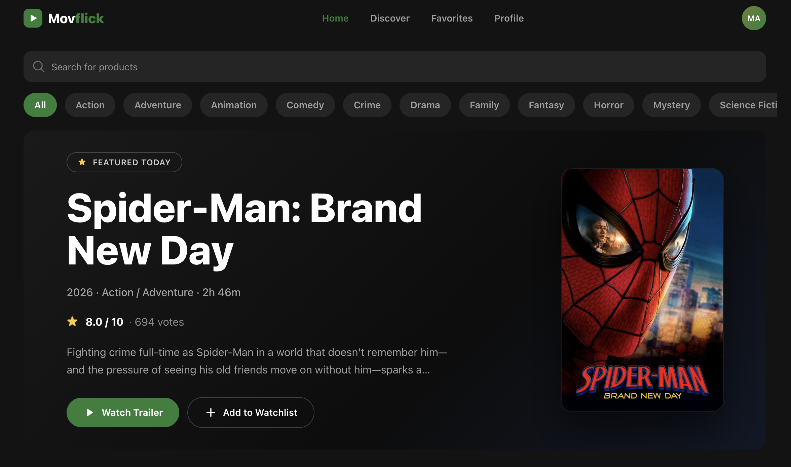
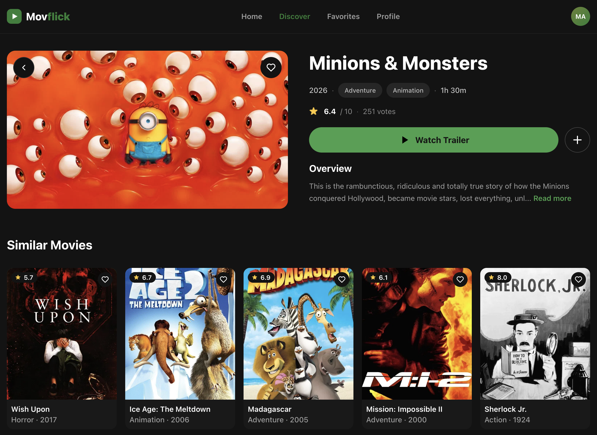
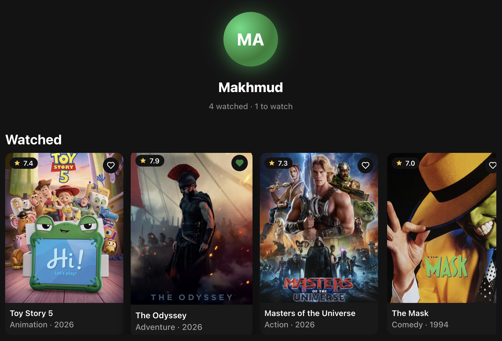

<div align="center">

# 🎬 Movflick

**Кино-трекер с аккаунтами, персональными списками и трейлерами**

Находи фильмы, смотри трейлеры, веди списки просмотренного — всё в одном месте.

[**🔗 Открыть Movflick**](https://themakhmud.github.io/Movflick/)


</div>

---

## ✨ Возможности

- 🔍 **Поиск и каталог** — трендовые и популярные фильмы, живой поиск, фильтры по жанрам
- 🎞️ **Страница фильма** — рейтинг, описание, длительность, похожие фильмы
- ▶️ **Кастомный трейлер-плеер** — свои контролы, пауза, звук, перемотка двойным тапом ±10 сек
- 👤 **Аккаунты** — регистрация с валидацией, вход, восстановление пароля через email
- ❤️ **Три личных списка** — Избранное, Просмотрено, Посмотреть позже — синхронизируются между устройствами
- 📱 **Адаптивный дизайн** — mobile-first с версией для ноутбуков
- 🌑 **Тёмная тема** — кинематографичный интерфейс

## 📸 Скриншоты

<div align="center">
  
</div>

## 🛠️ Технологии

| Категория | Стек |
|---|---|
| Фронтенд | React 19, Vite |
| Стили | Tailwind CSS v4, SCSS |
| Роутинг | React Router (BrowserRouter) |
| Бэкенд | Appwrite (Auth + Databases) |
| Данные о фильмах | TMDB API |
| Состояние | React Context (Auth, Lists) |
| Деплой | GitHub Pages |

## 🏗️ Как это устроено

```
App
├── AuthContext        — сессия пользователя (Appwrite Auth)
├── FavoritesContext   — три списка фильмов (Appwrite Database)
└── Router
    ├── Home           — hero, тренды, популярное, поиск, жанры
    ├── MoviePage      — детали фильма + трейлер + похожие
    ├── Favorites      — избранное
    ├── Profile        — просмотрено / посмотреть позже, выход
    └── Auth           — вход / регистрация / сброс пароля
```

- Списки пользователя хранятся в Appwrite с document-level permissions — каждый видит только свои данные
- Незалогиненный пользователь свободно смотрит каталог; действия со списками ведут на страницу входа с возвратом обратно
- Трейлеры — YouTube IFrame API с собственным интерфейсом управления

## 🚀 Запуск локально

```bash
git clone https://github.com/theMakhmud/Movflick.git
cd Movflick
npm install
```

Создайте `.env` в корне:

```
VITE_TMDB_API=ваш_ключ_TMDB
VITE_APPWRITE_PROJECT_ID=id_проекта_appwrite
VITE_APPWRITE_ENDPOINT=https://fra.cloud.appwrite.io/v1
VITE_APPWRITE_DB_ID=id_базы
VITE_APPWRITE_COLLECTION_ID=id_коллекции
```

```bash
npm run dev
```

## 👤 Автор

**Makhmud** — [GitHub](https://github.com/theMakhmud) · [Telegram](https://t.me/makhmudDev)

Проект создан в процессе изучения React — от первого `npm create vite` до полноценного приложения с бэкендом.
